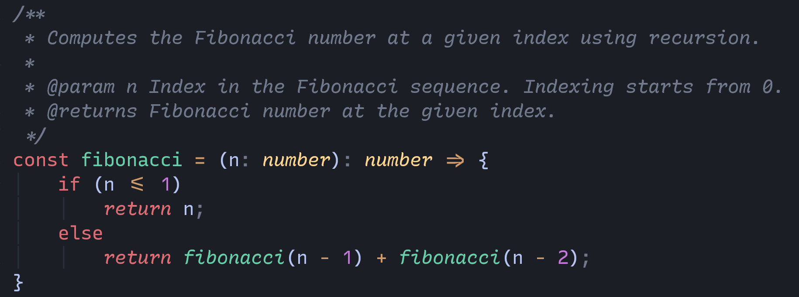

# Nightfall Dimmed

## Introduction

A dimmed, dark & beautiful theme made by developers, for developers.

### Features

- Based on various popular other themes.
- Customizable.
- Rich support for common file types and plugins.
- Tree-sitter support.
- Semantic highlighting support.

## Inspirations

The theme is a pretty much direct port of the Nightfall Dimmed color scheme for VS Code. The only real difference is that the colors have been rearranged.

- [nightfall dimmed vscode](https://marketplace.visualstudio.com/items?itemName=einknuffy.nightfall-dimmed)

## Comparison and showcase

nightfall-dimmed.nvim

Nightfall Dimmed VS Code

## Credit

Thanks to [sainnhe](https://github.com/sainnhe) for making the theme that was used for creating this one. [Everforest](https://github.com/sainnhe/everforest).

## License

[MIT](./LICENSE) © DJARUUN
